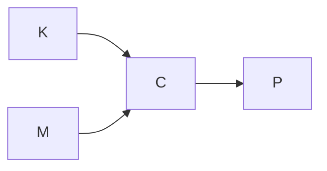

# msecpgen

A python Password Generator

## Introduction

### Key

Key can be Name of platform, Name of platform + email

### Master

Master is the password that is used for all logins

### Password

Password is the corresponding password on the website with the given key

### Parameters

Parameters used for the password generation, changing them will cause wrong outputs. This can either be output length (Lengths of 16-32 are safe) or used procedures

### Concept

Basically, the whole process is a cipher, our Key is the plaintext, our Master is the Key and the Password is the ciphertext (dont mind the confusing name)

Here is a simple flow chart:

By knowing this, we can conclude that our goal basically is to design a cipher with a blocklength of n which is resistant to known plaintext attacks, this is because our main goal is to prevent the hacker from getting the master password in case a password is known.

## Approaches

Simplest approach:

Expand Key and Master to length of Password

$K_{exp} \oplus M_{exp} = P$

Resulting weakness is fairly obvious:

If one Password is known for a certain key the Master can be retrieved by

$M_{exp} = P \oplus K_{exp}$
